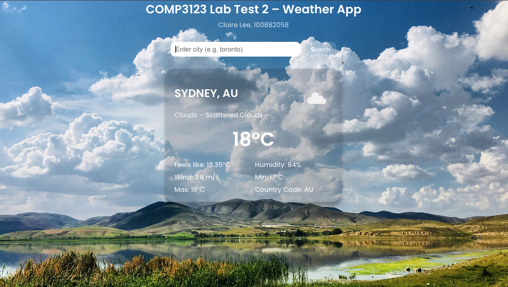
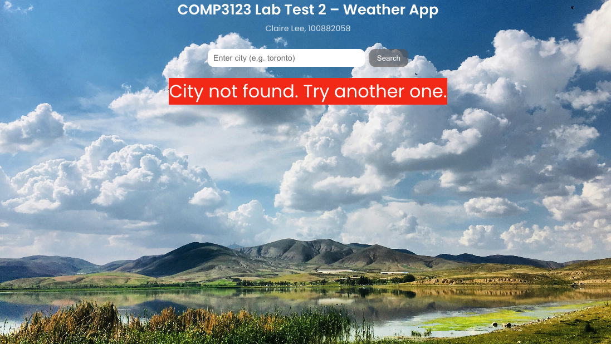

# 100882058_comp3123_labtest2

Simple React weather app for COMP3123 Lab Test 2.  
Enter a city with a 2-letter country code (`TORONTO,ca`) or just the city name (`toronto`) to see current weather.

**Deployed URL:** Vercel
https://100882058-comp3123-labtest2-5axh.vercel.app

````md
## Features

- Displays temperature (°C), feels-like, humidity, wind speed and condition icon
- City names show in **UPPERCASE**
- On invalid search, last valid weather stays visible and shows a short error

---

## Setup

Install dependencies:

```sh
npm install
```

Start the app:

```sh
npm start
```

---

## API Key

Add your key in `.env` (project root):

```env
REACT_APP_APIKEY=your_api_key_here
```

Used in code like this:

```js
const API_KEY = process.env.REACT_APP_APIKEY;
```

Restart the server after updating `.env`.

---

## Build & ZIP for Submission

Create production build:

```sh
npm run build
```

Zip the project (exclude `node_modules` and `build`):

```sh
zip -r 100882058_comp3123_labtest2.zip . -x "node_modules/*" "build/*" "*.zip"
```

---

## Screenshots

  
_GET /weather?q=TORONTO,ca response in Postman_

  
_Weather card on initial load_

  
_Error handling for invalid CITY,code query_

---

## Notes

- Uses OpenWeatherMap current-weather endpoint
- Weather icons via: `http://openweathermap.org/img/wn/{icon}@2x.png`
- Temperature unit is °C (metric)
````
